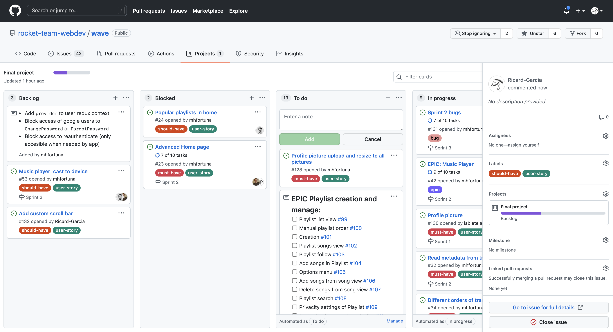

<!-- ## Figma [Figma file](https://www.figma.com/file/zbUncRShPQWo5vZgEmyKHG/WaveApp?node-id=0%3A1) [Cloudinary API](https://cloudinary.com/documentation/image_upload_api_reference#destroy_method) [multer](https://github.com/expressjs/multer) --> <p align="center">  <h1 align="center" >WaveApp</h1> </p>

WaveApp is a streaming music web application where you can share and discover songs, playlists and albums with other users. Built with MongoDB, Express, Node, Laravel, Firebase, Cloudinary and Laravel for the server side, and React, Redux for the client side. 

>You can see deployed our application [here](https://musikverein.netlify.app/) 

# 🚀 Getting Started 
These instructions will get you a copy of the project up and running on your local machine for development and testing purposes. See deployment for notes on how to deploy the project on a live system. 

## Requirements 📋 
You need to install [NodeJs](https://nodejs.org/) and [Docker](https://www.docker.com/products/docker-desktop) from their webpages Install Yarn globally: ``` npm install --global yarn ``` Once you have installed these programs, you need to create accounts for: - [Firebase](https://firebase.google.com/) - [MongoDB Atlas](https://www.mongodb.com/) - [Cloudinary](https://cloudinary.com/)

## Installation 🔧
First, you will need to `clone` or `fork` the repository into your Github account: 


 ``` $ git clone https://github.com/rocket-team-webdev/wave ``` 
 
You will need to configure Laravel: 

run `composer install` to install the PHP dependencies ``` docker-compose exec -T app composer install ``` 

Then you need to create a copy of the .env.example file and generate a new encryption key 

``` docker-compose exec -T app cp .env.example .env ``` 

```docker-compose exec -T app php artisan key:generate ``` 

Then run yarn install in the base folder ``` yarn install ```

When you have all the dependencies installed you need to create three .env files, one located in client folder, one in server folder, and the other in stats-server folder. 

The client .env file need to contain the next variables: 

``` 
REACT_APP_WAVE_API_ROUTE = http://localhost:4000/api
REACT_APP_WAVE_STATS_API_ROUTE = Your Laravel app route  
```

The server .env file need to contain the next variables:

``` 
MONGO_DB_URL_PRODUCTION = Your MongoDB Atlas connection url for producction 
MONGO_DB_URL_DEVELOPMENT = Your MongoDB Atlas connection url for development 
MONGO_DB_URL_TEST = Your MongoDB Atlas connection url for test 

# Access token to 
API ACCESS_TOKEN_SECRET = Your access token 

# Server settings 
PORT = 4000 

# Firebase settings 
FB_CERT_TYPE = Your FireBase cert type 
FB_CERT_PROJECT_ID = Your FireBase project id 
FB_CERT_PRIVATE_KEY_ID = Your FireBase private key id 
FB_CERT_PRIVATE_KEY = Your FireBase private key 
FB_CERT_CLIENT_EMAIL = Your FireBase client email 
FB_CERT_CLIENT_ID = Your FireBase client id 
FB_CERT_AUTH_URI = Your FireBase Auth uri 
FB_CERT_TOKEN_URI = Your FireBase token uri 
FB_CERT_AUTH_PROVIDER_X_509_CERT_URL = Your FireBase cert auth provider x 509 cert url 
FB_CERT_CLIENT_X_509_CERT_URL = Your FireBase cert client x 509 cert url 

# Cloudinary settings 
CLOUDINARY_API_KEY = Your Cloudinary API Key 
CLOUDINARY_API_SECRET = Your Cloudinary API Secret 
CLOUDINARY_NAME = Your Cloudinary name 
``` 


The stats-server .env file need to contain the next variables: 

``` 
APP_NAME = Laravel APP_ENV = local 
APP_KEY = Your generated encryption keys 
APP_DEBUG = true APP_URL = http://localhost 
LOG_CHANNEL = stack 
LOG_LEVEL = debug 
DB_CONNECTION = mysql 
DB_HOST = mysql 
DB_PORT = 3306 
DB_DATABASE = Your database 
DB_USERNAME = Your database username 
DB_PASSWORD = Your database password 
BROADCAST_DRIVER = log 
CACHE_DRIVER = file 
FILESYSTEM_DRIVER = local 
QUEUE_CONNECTION = sync 
SESSION_DRIVER = file 
SESSION_LIFETIME = 120 
PUSHER_APP_ID = 
PUSHER_APP_KEY = 
PUSHER_APP_SECRET = 
PUSHER_APP_CLUSTER = mt1 
MIX_PUSHER_APP_KEY = "${PUSHER_APP_KEY}" 
MIX_PUSHER_APP_CLUSTER = "${PUSHER_APP_CLUSTER}" 
API_KEY_REACT = Your react api key 
API_KEY_NODE = Your node api key 
``` 
# 🦴 Project Structure

## Folder structure 🗂
<pre>  
├── documentation <i>// All project wireframes, PRD, and presentation files</i>  
└── packages <i>// Monorepo workspaces</i>  
├── client <i>// Frontend React App</i>  
│ └── src  
│ ├── api <i>// All api petitions</i>  
│ ├── assets  
│ ├── components  
│ ├── constants  
│ ├── hooks  
│ ├── __mocks__ <i>// For testing purposes</i>  
│ ├── pages  
│ ├── redux  
│ ├── sass  
│ ├── services <i>// 3rd party services used</i>  
│ ├── __test__  
│ └── utils <i>// Reusable code snippets </i>  
├── server <i>// Backend Node Server</i>  
│ ├── src  
│ │ ├── config  
│ │ ├── controllers  
│ │ ├── db  
│ │ ├── middlewares  
│ │ ├── models  
│ │ ├── routes  
│ │ ├── services  
│ │ ├── __test__  
│ │ └── utils  
│ └── uploads <i>// Folder for temporary uploaded files</i>  
└── stats-server <i>// Backend PHP/Laravel Server</i>  
└── src  
├── app  
│ ├── Console  
│ ├── Exceptions  
│ ├── Http  
│ │ ├── Controllers  
│ │ └── Middleware  
│ ├── Models  
│ └── Providers  
├── config  
└── database  
</pre>

### Client-Side  🖥
For the front end of this project we used React framework. We created several component elements for every piece of code that should be reusable on the app. Then, we created all the pages that should be rendered on the browser and implemented its components and logic. To make the calls to the api, we created an _api_ folder with all of the routes we need to call from the app. We used Redux library to improve the data flow needed at several places of the application. As a third party service we used firebase to create a safe authentication for the app. We also implemented the necessary tests to assure that the code was running properly, you will find them at the _test_ folder.

### Server-Side 🔐
We divided the back end of our app in two parts. The main reason for this was to put in practice two different backend languages (Javascript and PHP).
#### NodeJS
This backend side is our main API. Here we receive most of the requests that are sent by the frontend. This API has the core functionalities of the backend such as the authentication, the database management and the use of other third party services like _cloudinary_. This API also interacts with the other side of our backend.
#### PHP Laravel
This is our secondary API. It was created to manage all the app statistics. Most of our application doesn't depend on this, but it is very useful to manage how our app is being used. 

## Deployment 🛫
For the deploy of our application we used [Heroku](www.heroku.com) for the backend and [Netlify](www.netlify.com) for our frontend.

During the development phase we implemented CI/CD on development branches.

# 🧭 App navigation 

## Entry points 🏁
WaveApp's entry point is a [sign in](https://wave-app-dev.herokuapp.com/sign-in) view from where the user is either able to log into the application or [sign up](https://wave-app-dev.herokuapp.com/sign-up) crete a new user. Both sign in and sign up forms allow the user to register to WaveApp manually or using Google's Firebase, allowing the user to select which account to use. 

## Dashboard 📈
WaveApp's home page (or dashboard) is the main view of the application, meaning that all its content is structured around what is displayed here. 

``` · Home · PopularWave · MyWave ``` 

The main purpose of WaveApp's home page is to show a summary of the most popular content in its database, on one side, and a summary of the current user's content, on the other. Both cases show visual blocks containing the top content in each case and a link to see a more detailed version (see below). Being able to have both of these views inside one page means that the current user can choose between these two view options through a group of radio buttons. 

``` · Search ``` 

In this view, WaveApp also allows the user to search amongst anything that is stored in its database. This means, submitting the text searched in the search bar will relocate the application to another page with a detailed result of what the user has searched for (songs, playlists, albums or users). 

## Content creation & visualization 🎧
The main purpose of WaveApp is to upload, share and stream music between users. Because of this, the application has several ways of dealing with the core content of the application: songs. Using WaveApp, the user is able to upload songs, assign an album, place it inside a playlists,… Tracks, albums and playlists can be both created and edited and all the forms used to do so are pretty similar. On the left there's a drag and drop and on the right a form to specify the details. 

`Tracks` 

Either going to _My songs_ or to the contextual menu inside the header, the user can choose to **upload** a song. The drag and drop area on the left accepts audio files while, on the right, the user can specify its _title_, _artist_, _genre_ and *album* . This form is used as well to **edit** the song. Tracks can be seen displayed in albums, playlists and in summary blocks. The also known as track card, allows the user to like a track, see its details or edit it via a context menu. 

`*Albums` 

The way of **creating albums** is through the *upload song* form. To create an album, the drag and drop allows the user upload an image as a cover of that album (or leave it with WaveApp's default one) while the form asks for a *title* and *release year*. Because WaveApp considers albums as a mandatory data of a track the select input cannot be left empty and if a song is not considered to be inside in an album, can be declared as a single. On the left, the album view displays its title, genres, release year, creator, likes and a play button. On the right, there's a list that can be sorted either manually or by clicking the sorter on the top.
 
 `Playlists`

Of course, playlists are a list of tracks! WaveApp doesn't differ much from other streaming applications in this sense. Inside the application the user can **create playlists** either going to _My playlists_ or in the contextual menu inside the header which will redirect to the form. The drag and drop allows the user to set a background image for that playlist (or leave it with WaveApp's default one). The form, allows the user to specify the name, color (used as a background if no image is set) and a description. There's also the possibility to make it public or private. All of these details can be edited as well. On the left, both the album and playlist views display its title, like/follow button, genres, release year, creator, likes and a play button. On the right, the different playlist cards are displayed. 

## User views 👩‍💻

 ``` · My profile. · User's profile. ``` 

One of the main purposes of WaveApp is to discover and connect with other users. This means that, there's not only a personal view with a summary of what the user has created, liked and followed so far but there's also the possibility to go to other user's profile page. Likewise in the home page, most of the content blocks allow to redirect the user to a more detailed view with all songs, albums or playlists created and liked/followed by the user.

`` · My/User songs · My/User albums · My/User playlists``

## Queue 👣
The queue is a global state in the application. The user can create a queue with the songs chosen to be played will be placed via the track card contextual menu. The view of this queue is similar to a usual playlist but the user can delete the whole list of tracks or close the view and go back to home. 

## Account management 🧩
WaveApp's current user can access a set of more detailed views of the account by clicking at the profile picture inside the header and accessing _account details_. 

``` User account ``` 

This view includes a general user account form with all the editable fields related to the user. The user can also delete the account and be redirected to the entry point of the app. 

``` · App stats ```

On the side bar, the user can access the _app stats_ view that will display the _top 5 reproduced songs_ with a bar chart and the _top 5 reproduced genres_ with a pie chart. 

``` · Reset password · Forgot password ```

Finally, the user can access a page to update its password inside the _password update_ view. Related to this, if a user tries to log into WaveApp but does not remember the password, there's a link to the reset password view as well in the sign in page. 

## Not found 🚫
Due to SEO stats, WaveApp also has a [not found](https://wave-app-dev.herokuapp.com/sign-up/some-unexistant-page) page that shows up every time the user tries to enter an unexistant page or a view using query params that no longer exist.

# 🗺 Project Journey

## Team Objectives 🎯

 - Clean & efficient Code
 - Comfortable user experience
 - Safe server side
 - Transparent and fluid team communication
 - Collaborative work

## Organization 📆
In order to achieve all of our goals we have implemented the Scrum Agile Methodology. We divided all the tasks into separated one week sprints, each of them with their own goals. To organize those sprints we set daily meetings to plan out and review restrospectively the whole week. We used Github Projects to divide our sprints, issues and tasks on boards using the Kanban structure. Github projects allowed us to automate and connect those issues with the branches of our repository. We also implemented a code review system in order to get all the team connected with all parts of the project.



## Coding Convention 🤝
Before starting the code development we set up some team conventions in order to establish the best possible work flow. This way, everyone could develop some code and know, at all times, how they should write the CSS Classes, Id's, React Components, etc. We also set nomenclature rules for the commits so we could find a concrete branch easily in case of need.

## Branch Naming Strategy 🎋
To manage all the processes of the project within the Scrum Agile Methodology using Github Projects and its automation, we agreed on a branch naming strategy so we could store into Github folders and subfolders all branches and divide them by sprints, epic tasks, user stories, and tasks with their own issue numbers and descriptions to connect our branches with their related Github issues so we could close them every time we created a Pull Request. 
An example of a branch name is the following:

`` epic-name/user-story/issue-number/B-F/subtask-name ``

# 🕵️‍♂️ Resources 

## Main resources 🧬
- [Axios](https://axios-http.com/docs/intro) 
- [Bootstrap](https://getbootstrap.com/) 
- [Cloudinary](https://cloudinary.com/) 
-  [Docker](https://www.docker.com/) 
-  [Eslint](https://eslint.org/) 
-  [Express](https://expressjs.com/) 
-  [Firebase](https://firebase.google.com/) 
-  [Jest](https://jestjs.io/) 
-  [Laravel](https://laravel.com/) 
-  [MongoDB](https://www.mongodb.com/) 
-  [Mongoose](https://mongoosejs.com/) 
-  [mySQL](https://www.mysql.com/) 
-  [Node JS](https://nodejs.org/) 
- [Prettier](https://prettier.io/) 
-  [React](https://es.reactjs.org/) 
-  [React Redux](https://es.redux.js.org/) 
-  [React Router](https://github.com/remix-run/react-router) 
-  [SASS](https://sass-lang.com/) 

## Support libraries 📚
- [Chart.js](https://www.chartjs.org/) 
- [Formik](https://github.com/formium/formik) 
- [Framer-motion](https://www.framer.com/motion/) 
-  [Helmet Async](https://github.com/staylor/react-helmet-async) 
- [History](https://github.com/remix-run/history) 
-  [Id3js](https://github.com/43081j/id3) 
-  [Morgan](https://github.com/expressjs/morgan) 
- [Multer](https://github.com/expressjs/multer) 
-  [Nodemon](https://nodemon.io/) 
-  [Node Cron](https://github.com/node-cron/node-cron) 
- [React-toastify](https://github.com/fkhadra/react-toastify) 
-  [React-dropzone](https://react-dropzone.js.org/) 
- [React-icons](https://react-icons.github.io/react-icons/) 
-  [React-device-detect](https://github.com/duskload/react-device-detect) 
-  [React-custom-scrollbars](https://github.com/malte-wessel/react-custom-scrollbars) 
-  [React-beautiful-dnd](https://github.com/atlassian/react-beautiful-dnd) 
-  [React-h5-audio-player](https://github.com/lhz516/react-h5-audio-player) 
-  [Supertest](https://github.com/visionmedia/supertest) 
-  [Validator](https://github.com/validatorjs/validator.js/) 
-  [Yup](https://github.com/jquense/yup) 

# 🖇️  Contributing 
If you want to contribute, please fork the repository, create a new branch whit your contribution, and push the branch as a pull requests. 

# ✨  Team  
Thanks goes to these wonderful people<!-- ALL-CONTRIBUTORS-LIST:START - Do not remove or modify this section --> <!-- prettier-ignore-start --> <!-- markdownlint-disable --> <table> <tr> <td align="center"><a href="https://github.com/bbenalia"><br /><sub><b>Brahim Benalia</b></sub></a><br /> <a href="https://github.com/rocket-team-webdev/wave/commits/develop?author=bbenalia" title="Code">💻</a> </td> <td align="center"><a href="https://github.com/labietelabiete"><br /><sub><b>Hugo Gómez</b></sub></a><br /><a href="https://github.com/rocket-team-webdev/wave/commits/develop?author=labietelabiete" title="Code">💻</a></td> <td align="center"><a href="https://github.com/Nachomontoya"><br /><sub><b>Nacho Montoya</b></sub></a><br /><a href="https://github.com/rocket-team-webdev/wave/commits/develop?author=Nachomontoya" title="Code">💻</a></td> <td align="center"><a href="https://github.com/Ricard-Garcia"><br /><sub><b>Ricard García</b></sub></a><br /><a href="https://github.com/rocket-team-webdev/wave/commits/develop?author=ricard-garcia" title="Code">💻</a> </td> <td align="center"><a href="https://github.com/mhfortuna"><br /><sub><b>Mathias Fortuna</b></sub></a><br /><a href="https://github.com/rocket-team-webdev/wave/commits/develop?author=mhfortuna" title="Code">💻</a></td> <td align="center"><a href="https://github.com/Ernest-DT"><br /><sub><b>Ernest Duocastella</b></sub></a><br /><a href="https://github.com/rocket-team-webdev/wave/commits/develop?author=ernest-dt" title="Code">💻</a> </td> </tr> </table> <!-- markdownlint-restore --> <!-- prettier-ignore-end --> <!-- ALL-CONTRIBUTORS-LIST:END --> This project follows the [all-contributors](https://github.com/all-contributors/all-contributors) specification. Contributions of any kind welcome! <!-- ALL-CONTRIBUTORS-BADGE:START - Do not remove or modify this section --> [](#contributors-) <!-- ALL-CONTRIBUTORS-BADGE:END -->
